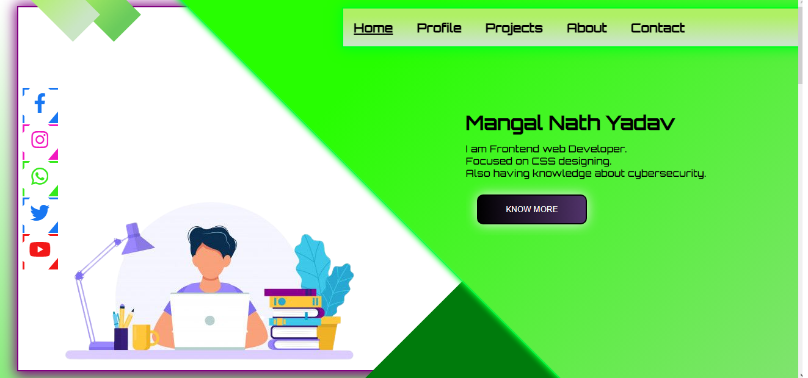

# Portofolio-MGHacker
MY Portofolio website.
First project for practicing CSS
View site - https://mghacker.netlify.app
Still under developemnet

# Preview of the Page
<blackquote>
 </img></blackquote>

# completed tasks
1- Home page
2- Header 
3- Footer
4- layout 
5- color combinations
6- home graphics using css

# Remaining tasks
1 - About page
2- Contact page 
3- profile page
4- projects page 
5- Make responsive using media quries for android
6- Make the code more readable using comments
